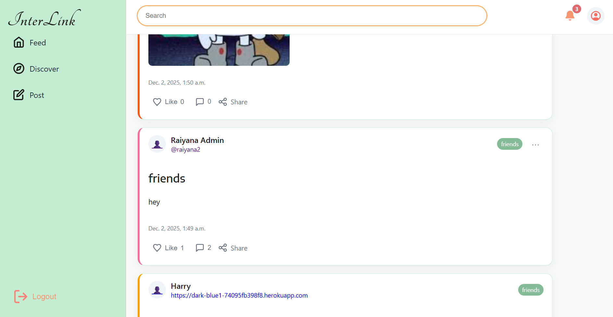

A Distributed Social Network!!
===================================

See [the web page](https://uofa-cmput404.github.io/general/project.html) for a description of the project.

## Team Members

| Name        | CCID   | GitHub Username |
| ----------- | ------ | --------------- |
| Utsha Samanta | usamanta | utshasamanta     |
| Raiyana Rahman| raiyana2 | raiyana2     |
| Pragya Das | pragya4 | pragya444     |
| Ling Zhuo | lzhuo2 | lz22222     |
| Kevin Ho He | hohe | kevinhh12     |
| Kehan Chen | kehan | KarlFranzman     |
| Amitoj Singh | amitoj2 | amitojxsingh |

## API Documentation
https://crimson-404-e3ab213c25f7.herokuapp.com/api/docs/swagger/

## License

This project is licensed under the Apache License 2.0 – see the [LICENSE](LICENSE) file for details.  

## Copyright

The authors claiming copyright for this project:  
- Utsha Samanta 
- Raiyana Rahman  
- Pragya Das  
- Ling Zhuo  
- Kevin Ho He  
- Kehan Chen  
- Amitoj Singh

## Collaboration (AI)

- The following test cases (EntryModelTests, AuthorEntriesViewTests) were written with the asistance of OpenAI, ChatGPT-5. 2025-10-19.

- The model Entry was written with the assistance of OpenAI, ChatGPT-5. 2025-10-19.
